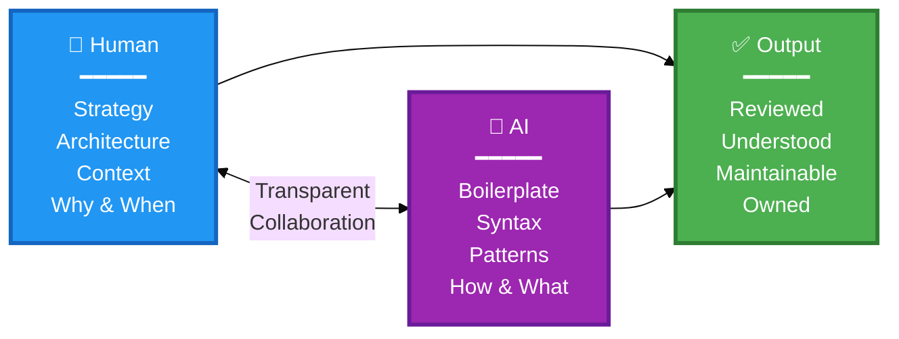

# Transparent Collaboration

Each contributes what they do best.

Humans remain in control.

::right::

```mermaid
%%{init: {'theme':'base', 'themeVariables': { 'fontSize':'16px'}}}%%
graph LR
    A["👤 Human<br/>━━━━━<br/>Strategy<br/>Architecture<br/>Context<br/>Why & When"]
    B["🤖 AI<br/>━━━━━<br/>Boilerplate<br/>Syntax<br/>Patterns<br/>How & What"]
    A <-->|Transparent<br/>Collaboration| B
    A --> C["✅ Output<br/>━━━━━<br/>Reviewed<br/>Understood<br/>Maintainable<br/>Owned"]
    B --> C

    style A fill:#2196F3,stroke:#1565C0,stroke-width:3px,color:#fff
    style B fill:#9C27B0,stroke:#6A1B9A,stroke-width:3px,color:#fff
    style C fill:#4CAF50,stroke:#2E7D32,stroke-width:3px,color:#fff
```
